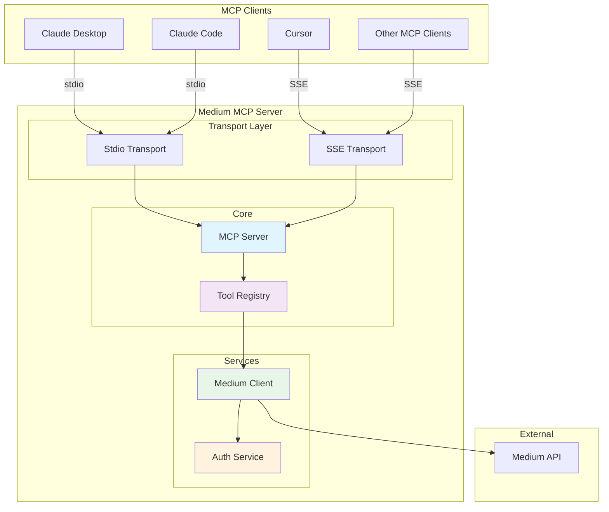
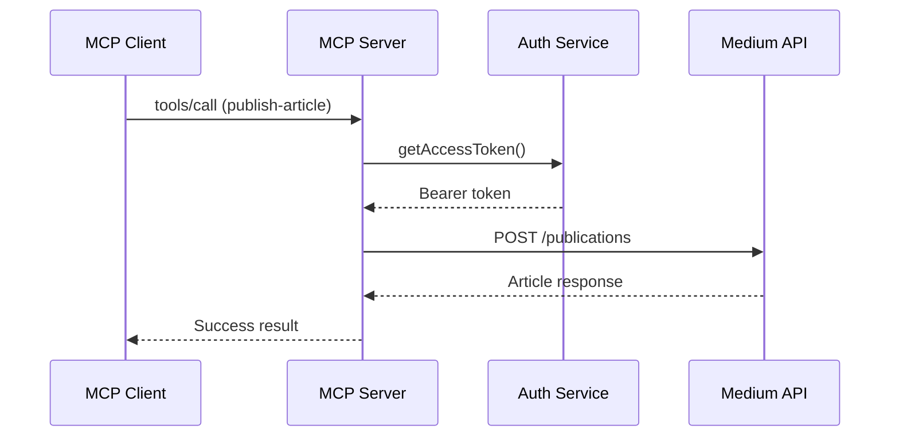
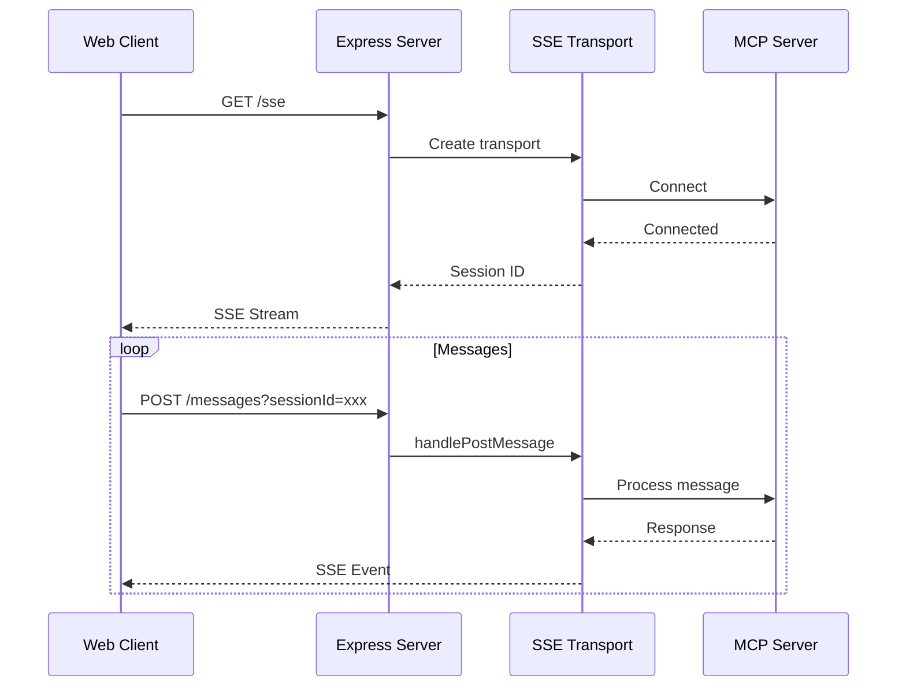

# Medium MCP Server - Architecture

System architecture and design overview for the Medium MCP Server.

## High-Level Architecture



## Component Overview

### Transport Layer

The server supports two transport mechanisms:

#### Stdio Transport (Default)
- Used for local development and direct integration
- Communicates via standard input/output streams
- No network configuration required
- Ideal for Claude Desktop integration

#### SSE Transport (HTTP)
- Used for remote deployment and network-based clients
- Express.js HTTP server with Server-Sent Events
- Enables web-based MCP clients
- Suitable for cloud deployment (Render, Heroku, etc.)

### Core Components

#### MCP Server (`src/index.ts`)
The main server class that:
- Initializes the MCP SDK server
- Registers available tools
- Manages transport connections
- Handles authentication lifecycle

```typescript
class MediumMcpServer {
  private server: McpServer;
  private mediumClient: MediumClient;
  private auth: MediumAuth;

  constructor() {
    this.auth = new MediumAuth();
    this.mediumClient = new MediumClient(this.auth);
    this.server = new McpServer({
      name: "medium-mcp-server",
      version: "1.0.0"
    });
    this.registerTools();
  }
}
```

#### Tool Registry
Three tools are registered:
1. **publish-article** - Create articles on Medium
2. **get-publications** - List user's publications
3. **search-articles** - Search for articles

### Service Layer

#### Auth Service (`src/auth.ts`)
Handles Medium OAuth authentication:
- Validates environment credentials
- Manages access tokens
- Provides security logging
- Handles authentication failures

```typescript
class MediumAuth {
  private clientId: string;
  private clientSecret: string;
  private accessToken: string | null = null;

  async authenticate(): Promise<void>;
  getAccessToken(): string;
}
```

#### Medium Client (`src/client.ts`)
HTTP client for Medium API:
- Makes authenticated requests
- Handles response parsing
- Manages error handling
- Supports markdown content format

```typescript
class MediumClient {
  private auth: MediumAuth;
  private baseUrl = 'https://api.medium.com/v1';

  async publishArticle(params): Promise<any>;
  async getUserPublications(): Promise<any>;
  async searchArticles(params): Promise<any>;
}
```

## Data Flow

### Publish Article Flow



### SSE Connection Flow



## File Structure

```
src/
├── index.ts              # Main entry point
│   ├── MediumMcpServer   # Server class
│   ├── registerTools()   # Tool registration
│   ├── startStdio()      # Stdio mode
│   └── startHttp()       # SSE mode
│
├── auth.ts               # Authentication
│   ├── MediumAuth        # Auth class
│   ├── authenticate()    # OAuth flow
│   └── getAccessToken()  # Token retrieval
│
├── client.ts             # API Client
│   ├── MediumClient      # Client class
│   ├── publishArticle()  # Create articles
│   ├── getUserPubs()     # List publications
│   └── searchArticles()  # Search content
│
└── transports/
    └── sse.ts            # SSE Transport
        ├── Express app   # HTTP server
        ├── /health       # Health check
        ├── /sse          # SSE endpoint
        └── /messages     # Message endpoint
```

## Configuration

### Environment Variables

```env
# Required
MEDIUM_CLIENT_ID=xxx      # OAuth Client ID
MEDIUM_CLIENT_SECRET=xxx  # OAuth Client Secret

# Optional
PORT=3000                 # SSE mode port
LOG_LEVEL=info           # Logging level
DEBUG=mcp:*              # Debug namespace
```

### Transport Selection

```
+------------------+
|  PORT env set?   |
+--------+---------+
         |
    +----+----+
    |         |
   YES        NO
    |         |
    v         v
+-------+  +-------+
|  SSE  |  | Stdio |
+-------+  +-------+
```

## Security Considerations

### Authentication
- Credentials loaded from environment variables
- Access tokens managed in memory
- Security alerts logged for failures
- No credentials stored in code

### Transport Security
- Stdio: Local process communication only
- SSE: Should be deployed behind HTTPS proxy

### Error Handling
- All errors caught and wrapped
- Sensitive data not exposed in errors
- Detailed logging for debugging

## Deployment Options

### Local Development (Stdio)
```bash
npm run dev
# or
npm run build && npm start
```

### Remote Deployment (SSE)
```bash
# Set PORT to enable SSE mode
PORT=3000 npm start

# Docker
docker run -p 3000:3000 -e PORT=3000 medium-mcp-server
```

### Cloud Deployment
- **Render**: Set PORT in environment
- **Heroku**: PORT set automatically
- **AWS/GCP**: Use container or VM deployment

## Scalability

### Current Limitations
- Single-process architecture
- In-memory session storage
- Synchronous API calls

### Future Improvements
- Redis for session storage
- Worker pool for requests
- Rate limiting middleware
- Caching layer for reads
